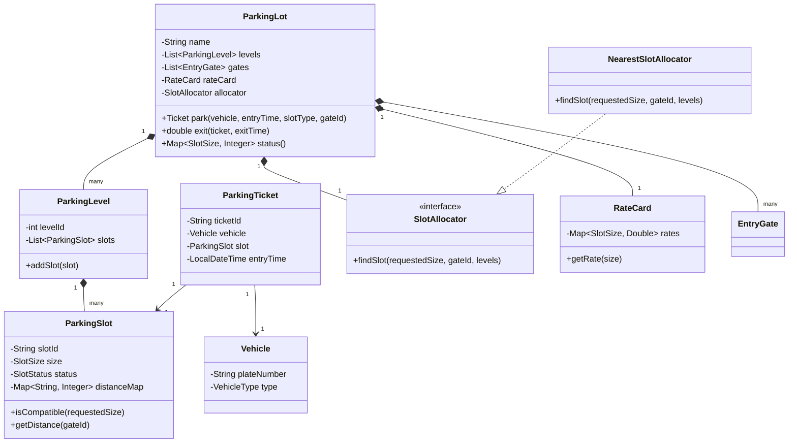

# Multilevel Parking Lot Design

## Problem Statement
Design a multilevel parking lot system that supports:
- Three slot types: **Small** (2-wheelers), **Medium** (cars), **Large** (buses).
- Multiple entry gates.
- Nearest available compatible slot assignment based on the entry gate.
- Vehicle compatibility: Smaller vehicles can park in larger slots (e.g., a bike can park in a Medium slot).
- Billing based on the **allocated slot type**, not the vehicle type.
- Functional APIs: `park()`, `status()`, and `exit()`.

---

## Class Diagram



---

## Design Approach

### 1. Strategy Pattern for Slot Allocation
The system uses the **Strategy Pattern** for deciding how to allocate slots. The `SlotAllocator` interface allows for different strategies (e.g., Nearest, Random, Level-based). The `NearestSlotAllocator` implementation ensures that the vehicle is parked in the available compatible slot closest to its entry gate.

### 2. Distance-Based Mapping
Each `ParkingSlot` maintains a `Map<String, Integer>` where the key is the `GateID` and the value is the `distance`. This allows the allocator to efficiently find the "nearest" slot by comparing distances for a specific gate.

### 3. Compatibility & Billing Logic
- **Compatibility**: Logic is encapsulated in the `ParkingSlot#isCompatible` method. It ensures that a requested size (e.g., Small) can be fulfilled by any slot of equal or larger size.
- **Billing**: The `ParkingLot#exit` method calculates the bill based on the duration (rounded up to the nearest hour) and the rate associated with the **SlotSize**, not the vehicle type.

### 4. Singleton Pattern
The `ParkingLot` class is implemented as a Singleton to ensure a centralized point of management for the entire system, preventing multiple instances from corrupting the parking state.

---

## How to Run
1. **Compile**:
   ```bash
   javac -d out (Get-ChildItem -Recurse -Filter *.java src | % { $_.FullName })
   ```
2. **Run Demo**:
   ```bash
   java -cp out parkinglot.Main
   ```

---

## Key Features Implemented
- [x] Multilevel support.
- [x] Multiple entry gates.
- [x] Nearest slot strategy from entry gate.
- [x] Flexible billing (slot-based).
- [x] Support for small vehicles in large slots.
- [x] Comprehensive Javadoc and clean modular structure.
