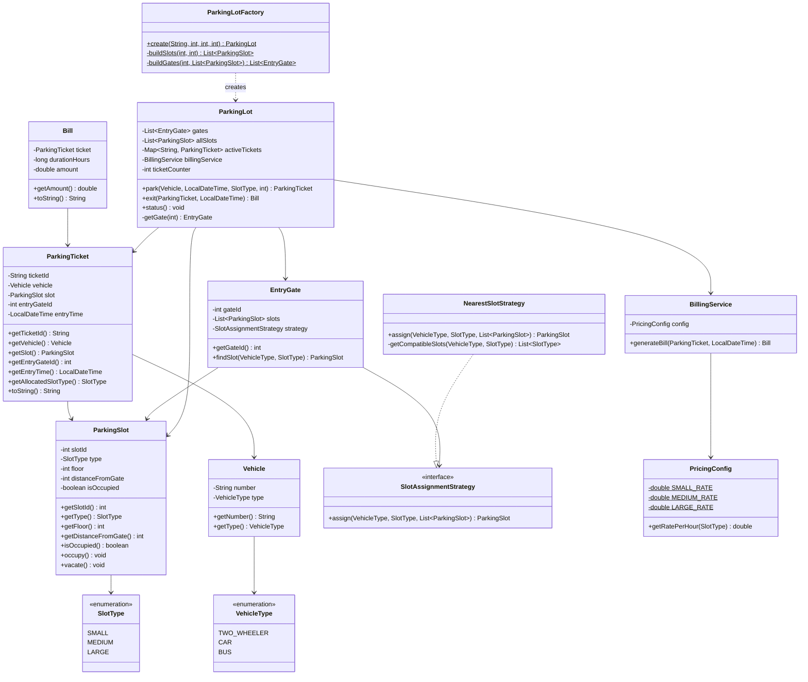

# Parking Lot UML Class Diagram

```mermaid
classDiagram
    class VehicleType {
        <<enumeration>>
        TWO_WHEELER
        CAR
        BUS
    }
    
    class SlotType {
        <<enumeration>>
        SMALL
        MEDIUM
        LARGE
    }
    
    class Vehicle {
        -String number
        -VehicleType type
        +getNumber() String
        +getType() VehicleType
    }
    
    class ParkingSlot {
        -int slotId
        -SlotType type
        -int floor
        -int distanceFromGate
        -boolean isOccupied
        +getSlotId() int
        +getType() SlotType
        +getFloor() int
        +getDistanceFromGate() int
        +isOccupied() boolean
        +occupy() void
        +vacate() void
    }
    
    class ParkingTicket {
        -String ticketId
        -Vehicle vehicle
        -ParkingSlot slot
        -int entryGateId
        -LocalDateTime entryTime
        +getTicketId() String
        +getVehicle() Vehicle
        +getSlot() ParkingSlot
        +getEntryGateId() int
        +getEntryTime() LocalDateTime
        +getAllocatedSlotType() SlotType
        +toString() String
    }
    
    class Bill {
        -ParkingTicket ticket
        -long durationHours
        -double amount
        +getAmount() double
        +toString() String
    }
    
    class SlotAssignmentStrategy {
        <<interface>>
        +assign(VehicleType, SlotType, List~ParkingSlot~) ParkingSlot
    }
    
    class NearestSlotStrategy {
        +assign(VehicleType, SlotType, List~ParkingSlot~) ParkingSlot
        -getCompatibleSlots(VehicleType, SlotType) List~SlotType~
    }
    
    class PricingConfig {
        -double SMALL_RATE$
        -double MEDIUM_RATE$
        -double LARGE_RATE$
        +getRatePerHour(SlotType) double
    }
    
    class BillingService {
        -PricingConfig config
        +generateBill(ParkingTicket, LocalDateTime) Bill
    }
    
    class EntryGate {
        -int gateId
        -List~ParkingSlot~ slots
        -SlotAssignmentStrategy strategy
        +getGateId() int
        +findSlot(VehicleType, SlotType) ParkingSlot
    }
    
    class ParkingLot {
        -List~EntryGate~ gates
        -List~ParkingSlot~ allSlots
        -Map~String, ParkingTicket~ activeTickets
        -BillingService billingService
        -int ticketCounter
        +park(Vehicle, LocalDateTime, SlotType, int) ParkingTicket
        +exit(ParkingTicket, LocalDateTime) Bill
        +status() void
        -getGate(int) EntryGate
    }
    
    class ParkingLotFactory {
        +create(String, int, int, int)$ ParkingLot
        -buildSlots(int, int)$ List~ParkingSlot~
        -buildGates(int, List~ParkingSlot~)$ List~EntryGate~
    }

    Vehicle --> VehicleType
    ParkingSlot --> SlotType
    ParkingTicket --> Vehicle
    ParkingTicket --> ParkingSlot
    Bill --> ParkingTicket
    NearestSlotStrategy ..|> SlotAssignmentStrategy
    BillingService --> PricingConfig
    EntryGate --> SlotAssignmentStrategy
    EntryGate --> ParkingSlot
    ParkingLot --> EntryGate
    ParkingLot --> ParkingSlot
    ParkingLot --> ParkingTicket
    ParkingLot --> BillingService
    ParkingLotFactory ..> ParkingLot : creates
```
