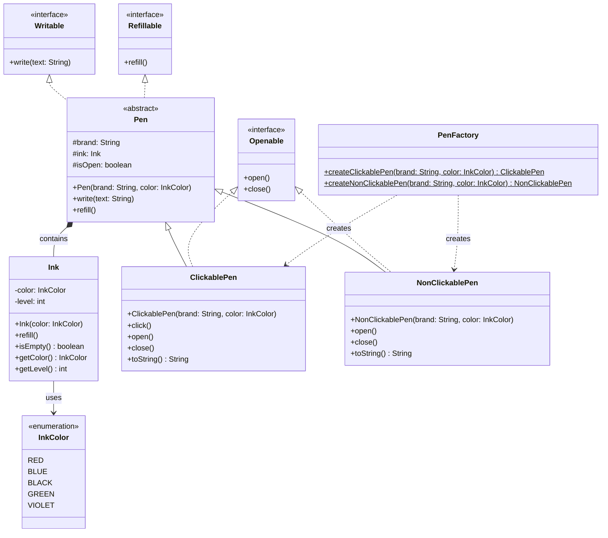

# Pen LLD

Low Level Design of a Pen system in Java, following SOLID principles.

## Features

- Open / Close a pen
- Write with a pen (validates pen is open and has ink)
- Refill ink
- Two pen types: **ClickablePen** (click to toggle) and **NonClickablePen** (cap-based)
- Colour selection via `InkColor` enum: `RED`, `BLUE`, `BLACK`, `GREEN`, `VIOLET`

## Project Structure

```
src/
├── enums/
│   └── InkColor.java
├── interfaces/
│   ├── Writable.java
│   ├── Refillable.java
│   └── Openable.java
├── models/
│   └── Ink.java
├── pens/
│   ├── Pen.java
│   ├── ClickablePen.java
│   └── NonClickablePen.java
├── factory/
│   └── PenFactory.java
└── Main.java
```

## Run

```bash
cd src
javac -d ../out enums/*.java models/*.java interfaces/*.java pens/*.java factory/*.java Main.java
java -cp ../out Main
```

## UML Diagram


