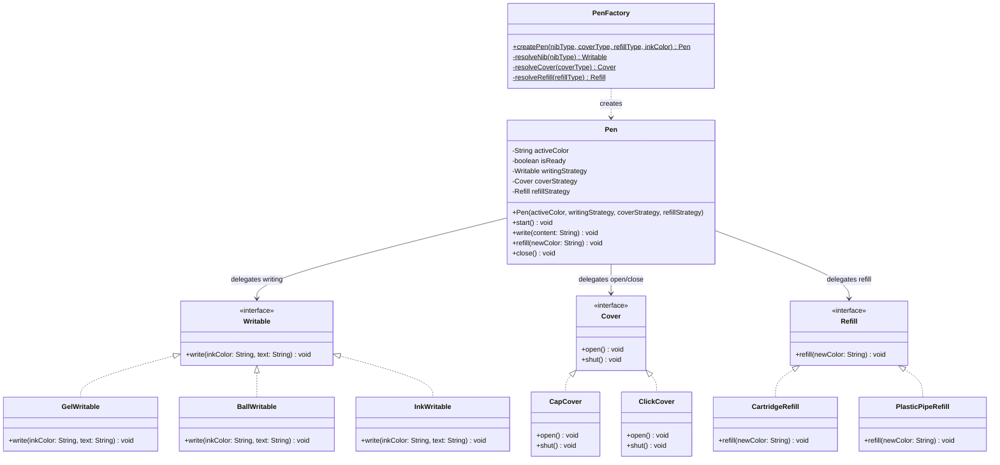

# 🖊️ Design A Pen — Low-Level Design (LLD)

## 📋 The Question

> **"Design a Pen"**
>
> The client will create a pen like:
> ```java
> Pen pen = PenFactory.createPen("gel", "cap", "cartridge", "Royal Blue");
> ```
> Each pen has the behaviours: `pen.write(content)`, `pen.refill(color)`, `pen.start()`, `pen.close()`.
> Each *type* of pen has different implementations of these four behaviours.
>
> **Follow-up Questions:**
> 1. How will you add **grip functionality** over `write()` with minimal changes?
> 2. What if the client wants to create a **Pencil without `refill()`**?

---

## 💡 Core Idea

This system treats every pen as a **composition of three swappable strategies** rather than hard-coded subclasses. The `Pen` class is completely decoupled — it only talks to interfaces, never to concrete implementations.

| Axis         | Interface    | Implementations                              | Purpose                        |
|-------------|-------------|----------------------------------------------|--------------------------------|
| **Writing** | `Writable`  | `GelWritable`, `BallWritable`, `InkWritable` | How ink reaches the paper      |
| **Cover**   | `Cover`     | `CapCover`, `ClickCover`                     | How the nib is protected       |
| **Refill**  | `Refill`    | `CartridgeRefill`, `PlasticPipeRefill`       | How ink is replenished         |

The `PenFactory` resolves string identifiers to the correct concrete implementations and returns a fully wired `Pen`. The `Pen` class also manages an `isReady` state — writing is blocked until `start()` is called.

---

## 📂 Project Structure

```
Pen LLD/
├── cover/                          ← Cover strategies
│   ├── Cover.java                  Interface: open() / shut()
│   ├── CapCover.java               Removes & places a protective cap
│   └── ClickCover.java             Click-button to extend / retract nib
│
├── writable/                       ← Writing strategies
│   ├── Writable.java               Interface: write(inkColor, text)
│   ├── GelWritable.java            Water-based gel ink — smooth & vibrant
│   ├── BallWritable.java           Rolling metal ball — oil-based ink
│   └── InkWritable.java            Liquid ink via capillary action
│
├── refill/                         ← Refill strategies
│   ├── Refill.java                 Interface: refill(newColor)
│   ├── CartridgeRefill.java        Swap spent cartridge for a new one
│   └── PlasticPipeRefill.java      Inject ink into a reusable plastic tube
│
├── model/                          ← Core model
│   └── Pen.java                    Orchestrator + isReady state management
│
├── factory/                        ← Creation logic
│   └── PenFactory.java             Resolves strings → strategies → Pen
│
├── Main.java                       ← Demo entry point
└── README.md
```

---

## 📊 Class Diagram



---

## 🧩 Design Patterns & Principles Applied

### 1. Strategy Pattern (All Three Axes)
Each behavioral axis (writing, covering, refilling) is an **interface** with multiple plug-and-play implementations. The `Pen` never instantiates these itself — they are injected via the constructor. This means:
- Adding `MarkerWritable` → implement `Writable`. **Zero** changes to `Pen` or any other class.
- Adding `TwistCover` → implement `Cover`. Again, **zero** changes elsewhere.

### 2. Simple Factory Pattern
`PenFactory.createPen(...)` hides all the `new` calls. The client just passes human-readable strings and receives a ready-to-use `Pen`. Internally, the factory delegates to three private helper methods (`resolveNib`, `resolveCover`, `resolveRefill`) for clean code.

### 3. Composition over Inheritance
Instead of an explosion of subclasses like `GelCapCartridgePen`, `BallClickPipePen`, etc., we compose behavior from independent components. With 3 nibs × 2 covers × 2 refills = **12 combinations** — all handled by *one* `Pen` class.

### 4. State Management
The `isReady` flag ensures the pen can only write when open. Calling `write()` on a closed pen prints a warning instead of silently doing nothing.

---

## ❓ Answers to Follow-Up Questions

### Q1: Adding Grip Functionality Over `write()` — Minimal Changes

**Solution: Decorator Pattern**

Create a `GripWritableDecorator` that wraps any `Writable` and adds grip behavior *before delegating* to the original `write()`. No existing class is modified.

```java
// NEW FILE — no changes to any existing code
public class GripWritableDecorator implements Writable {
    private final Writable innerWritable;

    public GripWritableDecorator(Writable innerWritable) {
        this.innerWritable = innerWritable;
    }

    @Override
    public void write(String inkColor, String text) {
        System.out.println("[Grip] Holding firmly with ergonomic rubber grip...");
        innerWritable.write(inkColor, text);  // delegate to original
    }
}
```

**Usage:**
```java
Writable gelNib     = new GelWritable();
Writable grippedNib = new GripWritableDecorator(gelNib);
Pen pen = new Pen("Blue", grippedNib, new CapCover(), new CartridgeRefill());
```

**Why this works:**
- ✅ **Open/Closed Principle** — added behavior without modifying any existing class.
- ✅ **Composable** — decorators can stack: `new GripDecorator(new SmoothFlowDecorator(nib))`.

---

### Q2: Pencil Without `refill()` — Interface Segregation Principle (ISP)

**Solution:** Our design already separates `Writable`, `Cover`, and `Refill` into independent interfaces. A **Pencil** simply does not compose a `Refill` strategy:

```java
public class Pencil {
    private final Writable writingStrategy;
    private final Cover coverStrategy;

    public Pencil(Writable writingStrategy, Cover coverStrategy) {
        this.writingStrategy = writingStrategy;
        this.coverStrategy = coverStrategy;
    }

    public void start()              { coverStrategy.open(); }
    public void write(String content) { writingStrategy.write("graphite", content); }
    public void close()              { coverStrategy.shut(); }
    // No refill() method — ISP satisfied!
}
```

**Why this works:**
- ✅ **ISP** — Pencil isn't forced to implement a useless `refill()`.
- ✅ No `UnsupportedOperationException` hacks or empty method bodies.
- ✅ The class is honest about its capabilities.

---

## ▶️ How to Compile & Run

```bash
# Compile everything
javac cover/*.java writable/*.java refill/*.java model/*.java factory/*.java Main.java

# Run the demo
java Main
```

**Expected Output:**
```
╔══════════════════════════════════════════════╗
║   Scenario 1: Gel Pen (Cap + Cartridge)     ║
╚══════════════════════════════════════════════╝
[Cap] Pulling off the protective cap.
>> Pen is now OPEN and ready to write.
[Gel Nib] Smoothly writing in Royal Blue gel → "Design patterns are powerful!"
[Cartridge] Ejecting spent cartridge and loading a fresh Midnight Black cartridge.
>> Active color updated to: Midnight Black
[Gel Nib] Smoothly writing in Midnight Black gel → "Now writing after a refill."
[Cap] Securing the cap back onto the pen.
>> Pen is now CLOSED.

╔══════════════════════════════════════════════╗
║   Scenario 2: Ball Pen (Click + Pipe)       ║
╚══════════════════════════════════════════════╝
⚠ Cannot write — the pen is still closed! Call start() first.
[Click] Pressing button to push the nib out.
>> Pen is now OPEN and ready to write.
[Ball Nib] Rolling Black ink onto paper → "Meeting notes: review the LLD diagram."
[Click] Pressing button to pull the nib back in.
>> Pen is now CLOSED.

╔══════════════════════════════════════════════╗
║   Scenario 3: Ink Pen (Cap + Cartridge)     ║
╚══════════════════════════════════════════════╝
[Cap] Pulling off the protective cap.
>> Pen is now OPEN and ready to write.
[Ink Nib] Flowing Forest Green ink elegantly → "Elegant calligraphy practice."
[Cartridge] Ejecting spent cartridge and loading a fresh Crimson Red cartridge.
>> Active color updated to: Crimson Red
[Ink Nib] Flowing Crimson Red ink elegantly → "Switched colors mid-session!"
[Cap] Securing the cap back onto the pen.
>> Pen is now CLOSED.
```
