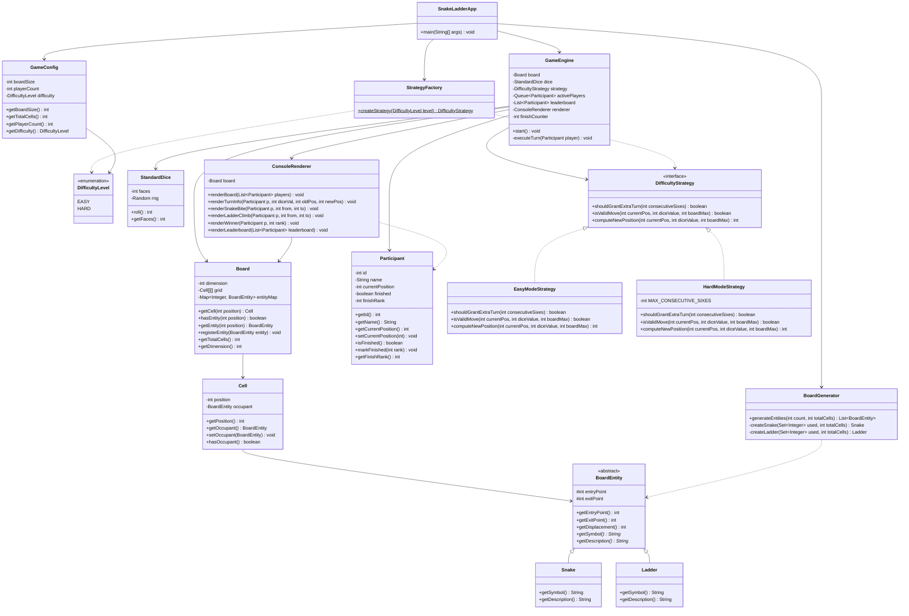

# Snake and Ladder — Low-Level Design (LLD)

A robust, highly extensible, and modular implementation of the classic Snake & Ladder game. This project demonstrates advanced Object-Oriented Design (OOD) principles and Low-Level Design patterns.

---

## 📝 Problem Statement

Design a Snake and Ladder application that simulates a game played on an `nxn` board.

### Input Parameters:
1.  **n**: Size of the board (dimension of the square grid).
2.  **x**: Number of players.
3.  **difficulty_level**: Options for `EASY` or `HARD`.

### Requirements:
*   The board should contain **n snakes** and **n ladders** placed randomly.
*   **Rules**:
    *   Players move based on a six-sided dice roll (1 to 6).
    *   Initial position: 0 (outside the board).
    *   Reach the last cell (n^2) to win.
    *   Snake Head -> Slid down to Tail.
    *   Ladder Bottom -> Climbed up to Top.
    *   **Easy Mode**: Any roll exceeding the final cell still wins (clamped to max). Unlimited re-rolls on a 6.
    *   **Hard Mode**: Must land EXACTLY on the final cell (overshoot results in no move). Re-rolls on 6 are capped (max 3 consecutive sixes before the entire turn is forfeited).
    *   The game continues until at least **2 players** remain (to determine the leaderboard).
    *   No cycles or infinite loops in snake/ladder placements.

---

## 🏗️ Class Diagram (Mermaid)



---

## 🧠 Detailed Explanation

### 1. **Core Logic - Event-Driven Flow**
The system follows a decoupled architecture where the `GameEngine` acts as an orchestrator. It manages a queue of `Participant` objects, ensuring turn-based play.
- **Turns**: A player rolls the dice and their position is updated based on the `DifficultyStrategy`.
- **Entity Interaction**: After the initial move, the engine checks for `BoardEntity` (snakes/ladders) at the new position. If found, a second jump is triggered immediately.

### 2. **State Management**
- `Board`: A grid container for `Cell` objects and a mapping of `BoardEntity` locations.
- `Participant`: Encapsulates all state related to a player (position, rank, finish status).

### 3. **Design Patterns Used**

| Pattern | Component | Purpose |
|---|---|---|
| **Strategy Pattern** | `DifficultyStrategy` | Dynamically swaps game rules for Easy vs Hard modes. The engine is "blind" to the rules and just asks the strategy. |
| **Factory Pattern** | `StrategyFactory` | Handles the creation logic for rules based on user input. |
| **Procedural Generation** | `BoardGenerator` | Uses a randomized placement algorithm to ensure fairness while avoiding cycles or overlapping entry/exit points. |
| **Template Method** | `BoardEntity` | The abstract base class defines the movement logic (`getDisplacement`), while concrete classes `Snake` and `Ladder` define specific metadata (symbols, direction). |

---

## 🛠️ How to Compile & Run

### 1. Compile

Navigate to the project root and run:
```bash
javac -d out -sourcepath src/main/java src/main/java/com/snakeandladder/SnakeLadderApp.java
```

### 2. Run

```bash
java -cp out com.snakeandladder.SnakeLadderApp
```

---

## 🎮 Interface Features
- **Grid Visualization**: Renders an N x N grid in the terminal top-down.
- **Player Tracking**: Shows markers like `P1,P2` on the board cells.
- **Live Event Logs**: Dynamic messages for snake bites, ladder climbs, and dice roll history.
- **Leaderboard**: Displays final rankings of winners once the game ends.
