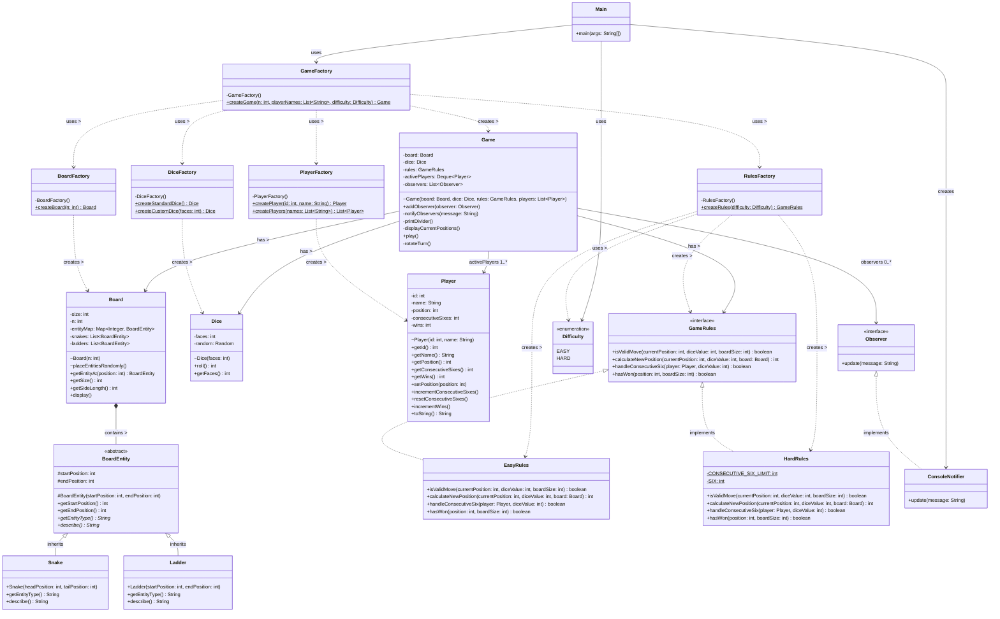

# Snake & Ladder UML Class Diagram

This diagram visualizes the structural and architectural design of the Snake and Ladder game implementation. It highlights the use of Design Patterns such as Factory Pattern, Strategy Pattern, and Observer Pattern.

